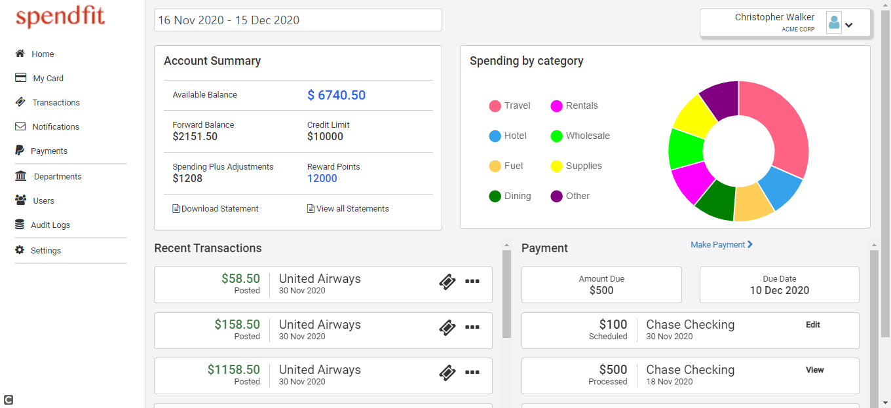

# Spendfit

This project was generated with [Angular CLI](https://github.com/angular/angular-cli) version 11.1.4.

## Development server

Run `ng serve` for a dev server. Navigate to `http://localhost:4200/`. The app will automatically reload if you change any of the source files.

## JSON server

Run `json-server --watch mockdata/data.json` for a json server. Navigate to `http://localhost:3000/`. Check json serer running or not and check no of collections(api) used. 

## Development and JSON server

Run `concurrently --kill-others \"npm run mock:server\" \"npm run start\"` for a dev server and json server. The two server started in one command.

cmd - npm run mock:server

## ScreenShot

